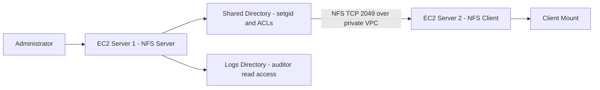

# Multi-User Linux Access Control and NFS Lab on AWS

## Overview

This hands-on portfolio lab demonstrates Linux identity and access administration across two Amazon Linux 2 EC2 instances. The environment uses POSIX permissions, setgid, access control lists (ACLs), Bash automation, and NFS shared storage. It also documents the validation and troubleshooting performed during the build.

This is a personal lab environment designed to practice cloud and Linux administration concepts. It is not presented as a production deployment.

## Medium Article

Read the complete project walkthrough, implementation details, troubleshooting notes, and lessons learned:

[Building Multi-User Linux Access Control and NFS Storage on AWS EC2](https://medium.com/@rester.mcglown/building-multi-user-linux-access-control-and-nfs-storage-on-aws-ec2-7646f27fad2c)

## Architecture



## Technologies Used

- AWS CLI, Amazon EC2, VPC networking, and security groups
- Amazon Linux 2 and Linux user/group administration
- POSIX permissions, setgid, and ACLs
- NFS shared storage
- Bash scripting
- Technical documentation and structured troubleshooting

## Project Objectives

- Provision two EC2 instances and administer them through the command line.
- Create developer, auditor, and application identities with role-based access.
- Configure shared directories with POSIX permissions, setgid, and ACLs.
- Automate user onboarding and validate failure handling with Bash.
- Configure an NFS server and persistent client mount over private VPC networking.
- Test each access path rather than relying only on configuration output.

## Phase 1: Users, Groups, and Directory Permissions

The initial environment used the following groups and directories:

```bash
sudo groupadd developers
sudo groupadd auditors

sudo mkdir -p /srv/appdata/shared /srv/appdata/logs
sudo chown root:developers /srv/appdata/shared
sudo chmod 2770 /srv/appdata/shared
sudo chown root:auditors /srv/appdata/logs
sudo chmod 0750 /srv/appdata/logs
```

`2770` applies the setgid bit to the shared directory so new objects inherit the `developers` group. Because setgid does not guarantee group-write permission by itself, default ACLs were used to provide consistent access for new content:

```bash
sudo setfacl -m g:developers:rwx /srv/appdata/shared
sudo setfacl -d -m g:developers:rwx /srv/appdata/shared
sudo setfacl -d -m m:rwx /srv/appdata/shared
```

## Phase 2: Granular ACLs and Bash Automation

ACLs were used when individual access needed to differ from the directory's primary group permissions:

```bash
sudo setfacl -m u:developer1:rw /srv/appdata/shared/sensitive.txt
sudo setfacl -m u:developer2:r /srv/appdata/shared/sensitive.txt
sudo setfacl -m u:auditor:r /srv/appdata/shared/sensitive.txt
sudo setfacl -m u:auditor:x /srv/appdata/shared
```

The directory execute permission is necessary because a user must be able to traverse every parent directory before a file-level ACL can take effect.

The sample [`onboard_user.sh`](scripts/onboard_user.sh) script demonstrates user creation, role validation, group assignment, and repeatable onboarding.

## Phase 3: Private NFS Storage

Server 1 exported the shared directory only to the authorized NFS client. The security group allowed TCP port 2049 from the client security group rather than from the public internet.

The example export uses `root_squash`, which prevents a remote root user from automatically receiving root privileges on the exported filesystem:

```text
/srv/appdata/shared <client-private-ip>(rw,sync,root_squash,no_subtree_check)
```

Server 2 used a persistent mount similar to:

```text
<server-private-dns>:/srv/appdata/shared /mnt/appdata/shared nfs4 defaults,_netdev,nofail 0 0
```

`_netdev` identifies the mount as network-dependent, while `nofail` prevents a temporarily unavailable share from blocking the client boot process.

## Access Validation

| User | Shared write | Sensitive read | Sensitive write | Logs read |
|---|:---:|:---:|:---:|:---:|
| developer1 | Yes | Yes | Yes | No |
| developer2 | Yes | Yes | No | No |
| auditor | No | Yes | No | Yes |
| appuser | Yes | Yes | Yes | No |

The matrix was validated by switching to each test account and attempting the relevant file and directory operations.

## Troubleshooting Highlights

- **Service command failed in AWS CloudShell:** CloudShell was not the EC2 operating system. Connected to the instance through SSH before managing `systemd` services.
- **SSH timeout after an instance lifecycle change:** Refreshed the connection details and verified the current address, security group, route, and instance state.
- **No internet path:** Confirmed that the VPC had an attached internet gateway and an active default route where public connectivity was required.
- **Blackhole route:** Inspected the route state, replaced the route target, and verified connectivity rather than checking only that a route entry existed.
- **Environment required reconstruction:** Used written procedures and automation to rebuild user, group, directory, and ACL configuration. The underlying storage and instance lifecycle should be verified before assigning a root cause to lost state.

## Security Considerations

- SSH access should be restricted to an approved source address or controlled administrative path.
- NFS must not be exposed to the public internet.
- Port 2049 should be restricted to the authorized client security group or specific private addresses.
- `root_squash` is preferred over `no_root_squash` for this design.
- AWS credentials, private keys, Terraform state, account numbers, and live resource identifiers must not be committed.
- Test resources should be stopped or deleted after validation to avoid unnecessary charges.

## Lessons Learned

- File permissions depend on every directory in the path, not only the target file.
- setgid controls group inheritance, while default ACLs help preserve the intended permissions on newly created content.
- AWS connectivity depends on the combined state of the instance, addressing, security groups, gateways, and route tables.
- Documentation and automation make a lab environment easier to reproduce and troubleshoot.

## Repository Contents

```text
.
|-- README.md
|-- configs/
|   |-- exports.example
|   `-- fstab.example
|-- docs/
|   `-- troubleshooting.md
|-- scripts/
|   `-- onboard_user.sh
`-- .gitignore
```

## Future Improvements

- Provision the infrastructure with Terraform.
- Replace broad administrative SSH access with AWS Systems Manager Session Manager.
- Add automated validation using a shell-based test harness.
- Add CloudWatch monitoring and alerting for instance and NFS health.

